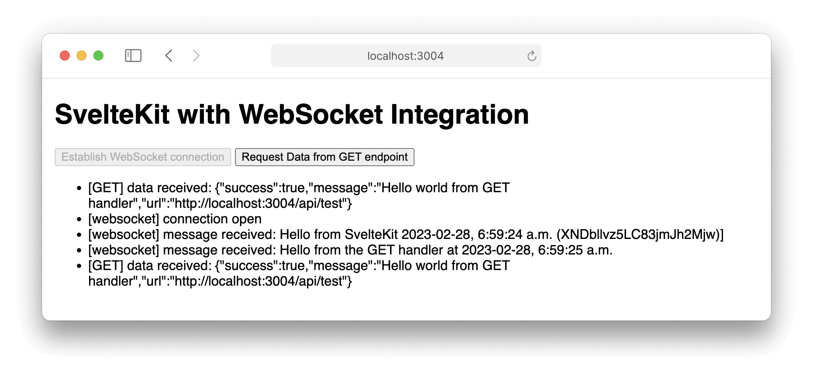

# SvelteKit with Integrated WebSocket Server

*Updated: July 4, 2023, compatible with SvelteKit 1.21.0 and Svelte 4.0.4*

First-class support for WebSockets within SvelteKit by attaching a WebSocket server to the global state.



## Developing

Once you've created a project and installed dependencies with `pnpm install`, start a development server on `localhost:3004`:

```bash
pnpm run dev --open
```

## Previewing

[Preview the production build](https://vitejs.dev/guide/cli.html#vite-preview) on `localhost:3003`:

```bash
pnpm run preview --open
```

## Building

To create a production version of the app and start a server on `localhost:3005`:

```bash
pnpm run build
pnpm run prodServer
```

***

## Write-up

[Svelte](https://svelte.dev/) has taken the web development community by storm. It provides a foundation for highly performant web applications, and in practice I've found it to be of even more value when developing larger, more complex projects. Powered with best-in-class front-end tooling powered by [Vite](https://vitejs.dev/), [SvelteKit](https://kit.svelte.dev/) is a flexible, multi-platform approach to building websites and web applications. SvelteKit recently hit 1.0 in December 2022, making it the ideal framework for any new projects, whether they be small pre-rendered static sites or large, multi-faceted client-heavy applications.

One glaring omission from the stable release of SvelteKit has been out-of-the-box integration for [WebSockets](https://developer.mozilla.org/en-US/docs/Web/API/Websockets_API). In many modern web applications, WebSockets are the preferred channel for real-time communication. With first-class support, the advantages of co-locating server-side code within the SvelteKit project structure is extended to real-time application logic. Utilities, logic and types can be shared across the codebase.

As of SvelteKit 1.21.0 (July 4, 2023), WebSockets are not supported out-of-the-box. The recommended way of integrating a custom WebSocket server within SvelteKit is through [middleware](https://kit.svelte.dev/faq#how-do-i-use-middleware). The helpful SvelteKit community has therefore provided a temporary solution:

- Write your WebSocket server code and logic within the SvelteKit project structure (for example `$lib/server/websocket`).
- Use [esbuild](https://esbuild.github.io/) to compile a single JavaScript file that contains the WebSocket server or logic (for example `/dist/websocket-middleware.js`).
- **For development**, define a [Vite plugin](https://vitejs.dev/guide/using-plugins.html) that extends the [`ViteDevServer`](https://vitejs.dev/guide/api-javascript.html#vitedevserver) and allows for upgrading HTTP requests to the WebSocket protocol. At this point you would import the compiled JavaScript WebSocket middleware and attach it to the newly established WebSocket server.
- **For production**, instead of running the pre-built Node.js server that [`@sveltejs/adapter-node`](https://kit.svelte.dev/docs/adapter-node) outputs, you would define a new Node.js server that integrates the request handler from SvelteKit, establish the WebSocket server and attach the same compiled JavaScript WebSocket middleware from the development server.

All of this works but is not particularly elegant and comes with some significant drawbacks:

- Every time your WebSocket logic changes you need to re-build the middleware and restart the development or production server.
- The WebSocket server operates in isolation from the SvelteKit application. It's not possible to reference the WebSocket server from any of the server-side SvelteKit code.
- If the WebSocket middleware pulls shared code (for example, from `$lib/server`) that references environment variables designed to work with SvelteKit (for example via `$env/dynamic/private`), this isn't compatible when building via `esbuild`. For these cases you'll have to rewrite code to use `process.env[...]`.
- If the WebSocket middleware pulls share code that uses external packages, such as the [Node.js MongoDB driver](https://github.com/mongodb/node-mongodb-native), you'll have to package the entire library into your single-file middleware due to constraints when running the module in the Vite development server.

This isn't ideal and it turns out that there's a better way to integrate a WebSocket server within SvelteKit in a manner that doesn't require a separate build step and makes the WebSocket server context available in all server-side SvelteKit code.

Rather than build the WebSocket server and/or logic as an isolated component, we can define a set of utility functions to:

1. Create a new WebSocket server and attach it to a *global instance variable*.
2. Define a function that upgrade certain HTTP requests to WebSocket connections.

These utilities will be used in development and production and reside within the SvelteKit project structure: `$lib/server/webSocketUtils.ts`.

For development, we'll still define an Vite plugin, but rather than import and attach a compiled middleware file, we'll import the two functions from `webSocketUtils` to set up a new WebSocket server and handle new connections.

For production, we'll set up a new file at the top-level directory called `prodServer.ts`. This script:

1. Imports and runs the built version of our SvelteKit application (via `pnpm run build`)
2. imports the same two functions from `webSocketUtils` and runs the WebSocket server alongside the SvelteKit server

In both development and production, the trick is to attach the WebSocket server to [`globalThis`](https://developer.mozilla.org/en-US/docs/Web/JavaScript/Reference/Global_Objects/globalThis), representing the global object. This WebSocket server instance is attached to the global state via a custom JavaScript Symbol via [`Symbol.for()`](https://developer.mozilla.org/en-US/docs/Web/JavaScript/Reference/Global_Objects/Symbol/for). This guarantees predictable, runtime-wide access to the server instance.

What this allows for is full control of the WebSocket server in our SvelteKit server-side logic. In `hooks.server.ts`, we can call a setup function that extends the WebSocket server and includes any logic that would need to run when either the development or production server is established. In addition, we can define custom logic in the `handler` function to attach the WebSocket server context to [`event.locals`](https://kit.svelte.dev/docs/types#app-locals). With this, you could:
- Integrate custom authentication logic in the `handler` function.
- Emit WebSocket events to clients directly from server-side endpoints (for example `GET` handlers).

With this, we achieve first-class support for WebSockets within SvelteKit!

## References

Thanks to the following resources:

- [trpc-sveltekit](https://github.com/icflorescu/trpc-sveltekit)
- [Discussion on SvelteKit repository regarding native WebSocket support](https://github.com/sveltejs/kit/issues/1491)
